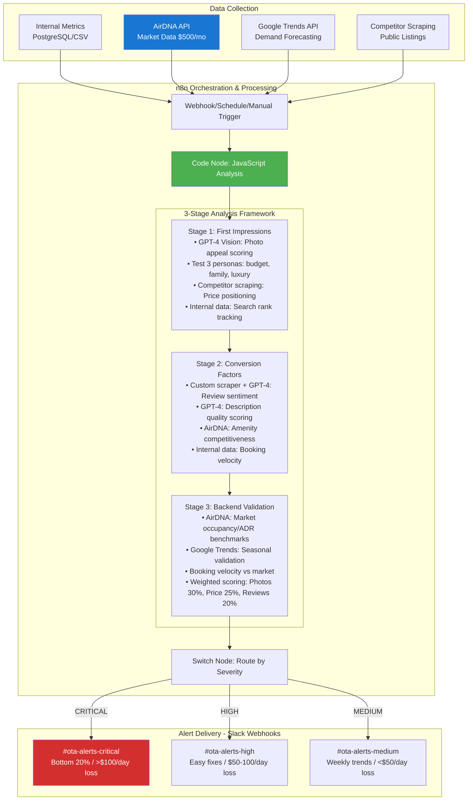

# System Architecture

## POC Implementation - Competitive Intelligence System

### The 3-Stage Analysis Framework

**Stage 1: First Impressions (What Gets Clicks)**

- GPT-4 Vision: Photo appeal scoring
- Test 3 personas via GPT-4: budget-conscious, family vacation, luxury seeker
- Title optimization for search keywords
- Price positioning vs competitors

**Stage 2: Conversion Factors (What Drives Bookings)**

- Description readability and persuasiveness
- Review sentiment analysis
- Amenity competitiveness scoring

**Stage 3: Backend Validation**

- Occupancy rate vs market average (AirDNA)
- Booking velocity comparison
- Google Trends: Seasonal validation
- Weighted Scoring: Photos (30%), Pricing (25%), Reviews (20%), Description (15%), Amenities (10%)

### Error Handling (3-Layer Failover)

1. **Data Collection**: Webhook → API polling → Web scraping
2. **Analysis**: GPT-4 → Rule-based scoring → Cached data (7-day max)
3. **Delivery**: Slack → n8n retry queue → Email digest backup

Never skip alerts due to partial data - flag as "Limited Analysis" and proceed.

### Data Sources Explained

- **Internal Data**: Your actual performance metrics
- **AirDNA API**: Market occupancy, ADR, RevPAR ($500/month)
- **Google Trends**: Demand forecasting (free)
- **Public Listings**: Competitor analysis via ethical scraping

### Cost Structure

- **n8n hosting**: $50/month (unlimited executions)
- **AirDNA API**: $500/month (market intelligence)
- **GPT-4 Vision**: ~$180/month (100 properties daily)
- **Total**: ~$730/month for complete intelligence

## What makes this a great solution?

1. **Scales efficiently**: Same architecture works for 10 or 1000 properties
2. **Cost-effective**: Fixed $730/month vs $6000+ for Zapier at scale
3. **Intelligent insights**: Not just "what's wrong" but "why" and "how to fix"
4. **Market context**: Performance relative to competitors, not absolute thresholds
5. **Actionable alerts**: Specific fixes with expected ROI, not generic warnings
6. **ROI**: 1.5-4x return on investment through revenue protection
