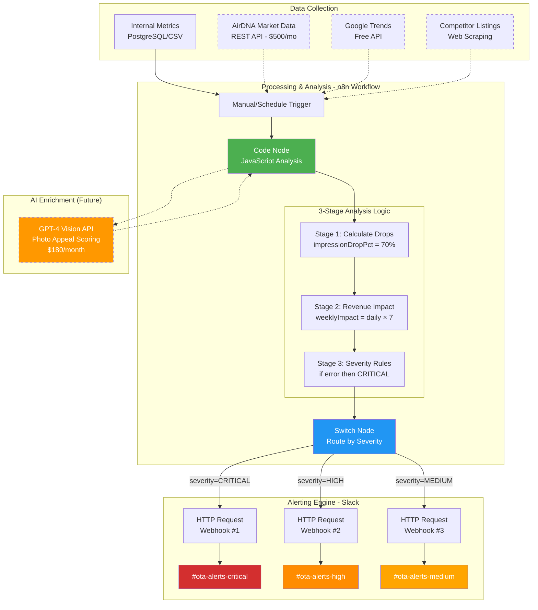

# Technical Implementation Diagram

## Legend
- **Solid lines**: Implemented in POC
- **Dashed lines**: Future enhancements
- **Green**: Core processing (n8n Code node)
- **Blue**: Routing logic (n8n Switch node)
- **Orange**: AI enhancement (not yet implemented)
- **Red/Orange/Yellow**: Severity-based Slack channels

## Key Technical Details Shown
1. **n8n Workflow** handles all orchestration
2. **Code Node** contains the 3-stage JavaScript analysis
3. **Switch Node** routes based on severity field
4. **3 separate HTTP Request nodes** with unique webhooks
5. **Future integrations** shown with dashed lines

This makes it clear that:
- The "3-Stage Analysis" is JavaScript code inside n8n, not separate services
- The "Alerting Engine" is n8n's Switch node + HTTP requests to Slack
- The AI enrichment is planned but not built yet