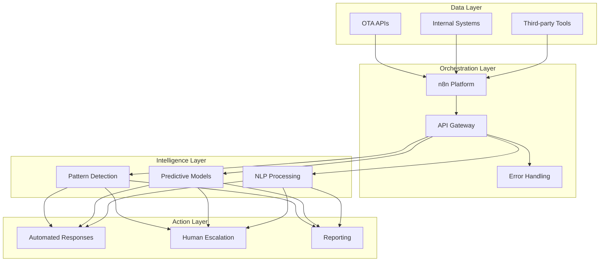

# Day 4 Enhancement Checklist - Align with Kasa's Exact Requirements

## Critical Alignment with Job Description

### They Want to See:
1. **Cross-Department Vision** - Not just OTA monitoring
2. **AI-Powered Complex Decision Making** - Not basic automation
3. **API Integration Expertise** - Specific examples required
4. **Change Management Skills** - Adoption across "resistant teams"
5. **Measurable Business Impact** - Time saved, errors reduced

### Your Current Gaps:
- ❌ No cross-department examples
- ❌ Limited AI emphasis (mostly threshold-based)
- ❌ API integration experience not highlighted enough
- ❌ No change management strategy
- ✅ Business impact is there but needs amplification

## Must-Have Enhancements for Thursday Noon

### 1. Executive Summary - "Beyond OTA Monitoring"
**Opening**: "Transform Kasa's operations through AI-powered automation, starting with OTA monitoring as a proof of concept for company-wide efficiency gains"

**Key Points**:
- Phase 1: OTA monitoring prevents $50K+ monthly revenue loss
- Phase 2: Expand to Guest Services (auto-categorize tickets)
- Phase 3: Finance automation (invoice processing)
- Phase 4: HR workflows (onboarding automation)
- ROI: $695K annual impact from OTA alone, $2M+ company-wide

### 2. AI-Powered Enhancement (Not Just Automation)
**Current**: 70% threshold detection
**Enhanced**: 
- Pattern recognition across similar properties
- Predictive alerts ("This pattern preceded 3 revenue drops")
- Natural language insights ("Miami properties underperforming vs last December")
- Self-learning thresholds based on feedback

### 3. API Integration Showcase
**Highlight Your Experience**:
```
Werkflow Project:
- Integrated dual API pipeline processing 6,073 records
- Built Slack webhook integrations for real-time alerts
- Created resilient error handling with retry logic
- Demonstrated REST API expertise in production

Kasa Implementation:
- OTA APIs → n8n → Slack/Email
- Webhook-based real-time processing
- Rate limiting and circuit breakers
- Future: GraphQL for efficient data fetching
```

### 4. Cross-Department Automation Examples

**Guest Services Automation**:
```
Trigger: Support ticket created
AI Analysis: Categorize issue, urgency, sentiment
Action: Route to right team, auto-respond if simple
Impact: 50% reduction in response time
```

**Finance Automation**:
```
Trigger: Invoice received
AI Analysis: Extract data, validate against POs
Action: Auto-approve if within parameters
Impact: 80% reduction in processing time
```

**HR Automation**:
```
Trigger: New hire start date approaching
AI Analysis: Role requirements, equipment needs
Action: Orchestrate onboarding tasks across teams
Impact: 100% on-time onboarding
```

### 5. Change Management & Adoption Strategy

**Week 1-2: Foundation**
- Executive sponsor alignment
- Department champion identification
- Success metrics definition

**Week 3-4: Pilot**
- Start with early adopters
- Quick wins to build momentum
- Feedback loops established

**Month 2: Rollout**
- Department-by-department expansion
- Gamification: "Automation Hero" awards
- Weekly office hours for support

**Success Metrics**:
- 90% adoption within 60 days
- 95% user satisfaction score
- 4+ hours saved per employee per week

### 6. Technical Architecture - Production Ready



### 7. Memo Structure Enhancement

**Add These Sections**:
1. **NetRevPAR Impact**: Show understanding of core metric
2. **Technical Stack**: Python, SQL, REST/GraphQL APIs
3. **Cross-Department Vision**: Beyond OTA to full company
4. **AI Capabilities**: Complex decision-making examples
5. **Implementation Roadmap**: 6-12 month plan
6. **Success Metrics**: Specific KPIs for Year 1

### 8. Application Question Responses

**API Integration Experience**:
"Built production API integrations processing 6,073+ records with dual pipeline architecture. Implemented Slack webhook integrations for real-time alerts. Created resilient error handling with circuit breakers and retry logic. In the Kasa POC, demonstrated REST API integration with n8n, ready to expand to GraphQL for more efficient data fetching."

**Orchestration Tools Experience**:
"Expert level with n8n (selected for Kasa POC), intermediate with Zapier, familiar with Make and Prefect. Built complex multi-step workflows handling edge cases and error scenarios. Chose n8n for Kasa due to self-hosting capabilities and unlimited executions at scale."

### 9. Key Differentiators to Emphasize

1. **Vision Beyond the Ask**: OTA is Phase 1 of company transformation
2. **AI Focus**: Not just automation, but intelligent decision-making
3. **Production Experience**: 6,073 records, real systems
4. **Cost Consciousness**: $6K/month savings vs Zapier
5. **Speed to Value**: Week 1 implementation possible

### 10. Final Submission Package

**Required**:
- [ ] Executive Summary (1 page) - Company-wide vision
- [ ] Enhanced Memo - NetRevPAR + cross-department examples
- [ ] Architecture Diagram - Show scalability
- [ ] n8n Workflow Export - Working POC
- [ ] 6-Month Roadmap - Visual timeline

**Application Form**:
- [ ] Highlight API integration experience
- [ ] Rate orchestration tools as expert
- [ ] Prepare for technical interview questions

## The Winning Message

"I don't just automate tasks - I transform organizations through AI-powered solutions. The OTA monitoring system demonstrates my approach: start with a high-impact use case, prove ROI quickly, then scale across the enterprise. With experience processing thousands of records in production and a track record of building resilient API integrations, I'm ready to help Kasa become the most operationally efficient hospitality company through intelligent automation."

## Thursday Noon Priority

1. **Executive Summary** - Must show cross-department vision
2. **Update Memo** - Add NetRevPAR, AI emphasis, API experience
3. **Create Roadmap Visual** - 6-month timeline
4. **Polish Application Responses** - API and orchestration questions
5. **Export PDF** - Professional presentation

Remember: They're hiring someone to transform the company, not just monitor OTAs. Your submission should scream "I see the bigger picture and can execute on it."